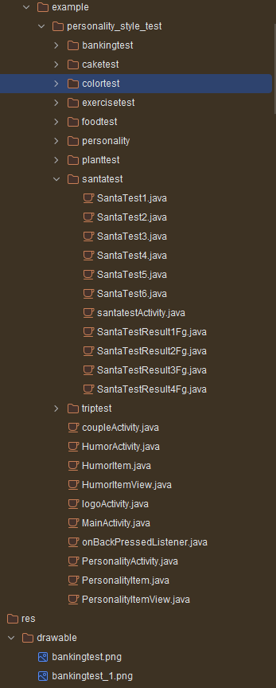
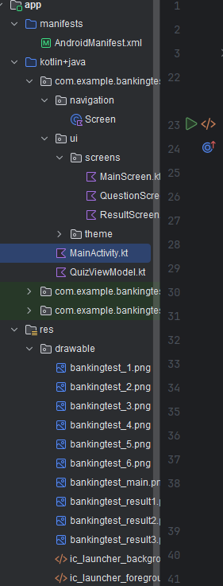
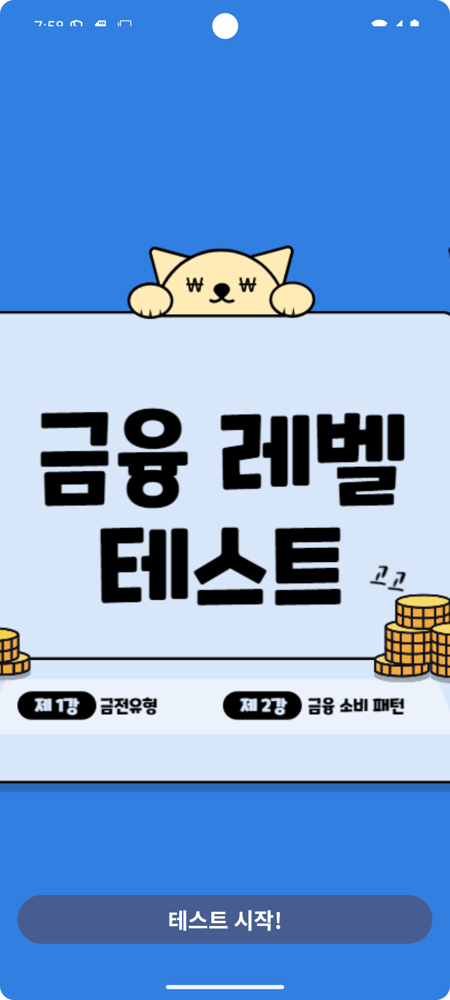
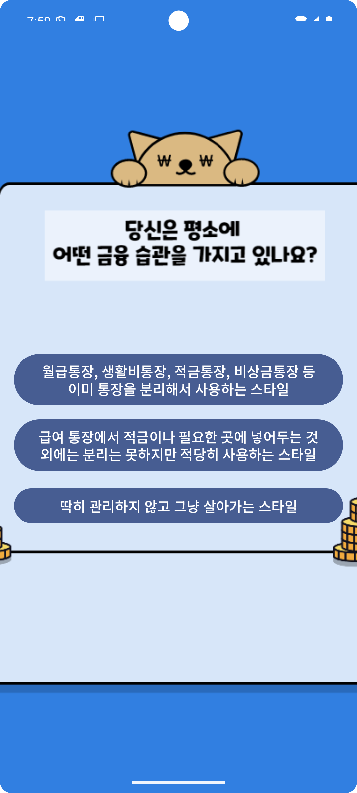
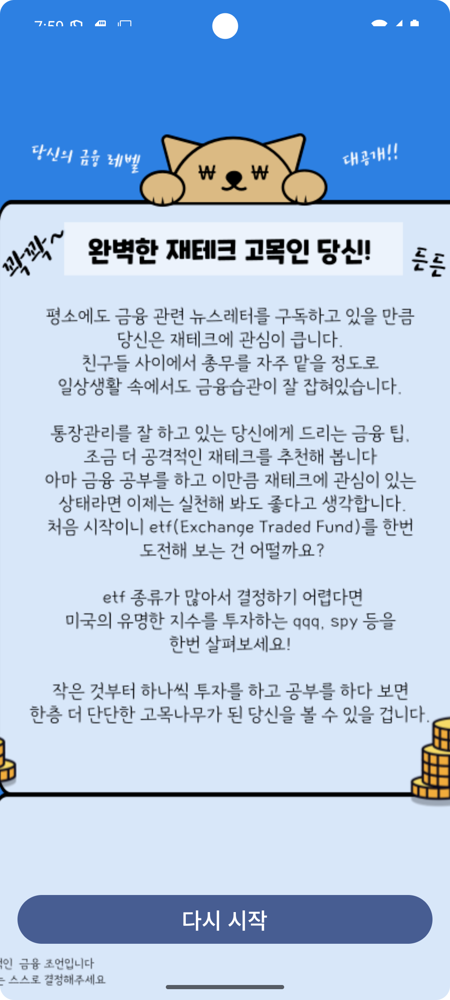
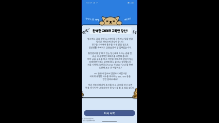

# 금융 테스트 앱 (Kotlin + Jetpack Compose)

[기존프로젝트 링크](https://github.com/ksubin-dev/personality-style-test-release2)

이 프로젝트는 기존의 복잡한 Java 기반 앱을 Kotlin과 Jetpack Compose를 사용하여 기존의 프로젝트에 있던 유형테스트 중 일부인 금융테스트를 가져와 리팩토링한 프로젝트입니다.

## 프로젝트 목표

기존의 Java 및 XML 기반 UI 개발 방식에서는 화면 하나하나마다 복잡한 액티비티/프래그먼트와 XML 레이아웃을 생성해야 했습니다. 이 프로젝트는 Jetpack Compose를 도입하여 다음과 같은 목표를 달성했습니다.

- **코드의 간결성**: 수많은 클래스와 파일을 하나로 통합하여 불필요한 코드를 대폭 줄였습니다.
- **유지보수의 용이성**: 화면의 상태 관리를 ViewModel로 일원화하고, 재사용 가능한 Composable 함수로 UI를 구축하여 유지보수를 쉽게 만들었습니다.

## 주요 기술 및 라이브러리

- **Kotlin**
- **Jetpack Compose** : UI를 선언적으로 구성하여 복잡한 XML 레이아웃을 대체합니다. Composable 함수로 각 화면을 정의하고, Surface와 Theme를 사용하여 앱의 스타일을 적용합니다.
- **Jetpack Navigation** : NavController를 사용하여 화면 간 이동을 관리합니다. NavHost를 사용하여 다양한 화면을 네비게이션 구조로 연결합니다.
- **ViewModel**

### 리팩토링 전 (Java + XML)

- 액티비티 및 프래그먼트가 각 화면마다 별도로 존재
- XML 레이아웃 파일로 UI 구성
- 여러 개의 액티비티 및 프래그먼트 파일을 관리해야 함

### 리팩토링 후 (Kotlin + Jetpack Compose)

- 단일 액티비티와 Composable 함수들로 화면 구성
- UI 선언형 방식으로 가독성 및 유지보수 용이성 향상
- 기존에 있던 여러 액티비티 파일들이 하나의 Composable 함수로 통합

### 리팩토링 전

  
 
Java 때 프로젝트 파일의 수

### 리팩토링 후

  
 
Kotlin과 Jetpack Compose로 리팩토링 후 프로젝트 구조가 이렇게 간결해졌습니다

## 앱 작동 순서

앱의 작동 흐름은 아래와 같습니다.

1. **메인 화면**
    
   
    
- 앱을 시작하면 메인 화면이 나타납니다. '테스트 시작!' 버튼을 누르면 퀴즈가 시작됩니다.
   

2. **퀴즈 화면**
    
   
    
-  각 문제 화면은 이미지를 배경으로 사용하며, 이미지에 맞춰진 위치에 답변 버튼만 깔끔하게 표시됩니다. 사용자의 답변 선택에 따라 다음 문제로 자동 이동합니다.

3. **결과 화면**
    
   
    
- 총 6개의 문제를 풀고 나면, 사용자의 선택에 따라 최종 결과 이미지가 표시됩니다.

## 기능 시연
    
   
    
- **다시 시작** 버튼을 누르면 퀴즈가 처음부터 다시 시작됩니다. 모든 상태가 초기화되어 매끄럽게 앱을 재사용할 수 있습니다.

## 코드의 흐름(MainActivity.kt 파일 참조)

- Main 화면: 앱을 시작하면 첫 번째 화면인 MainScreen이 표시됩니다. '퀴즈 시작!' 버튼을 클릭하면 퀴즈가 시작됩니다.

- 퀴즈 문제 화면: 각 문제는 QuestionScreen에서 표시되며, 사용자가 답을 선택하면 다음 문제로 자동 이동합니다.

- 결과 화면: 모든 문제를 완료하면 ResultScreen이 표시되며, 최종 결과를 확인하고 퀴즈를 다시 시작할 수 있습니다.
   

