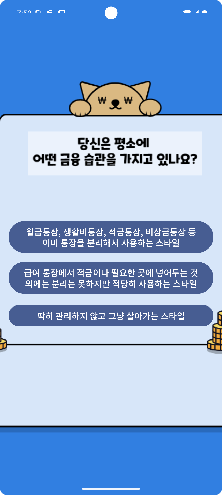
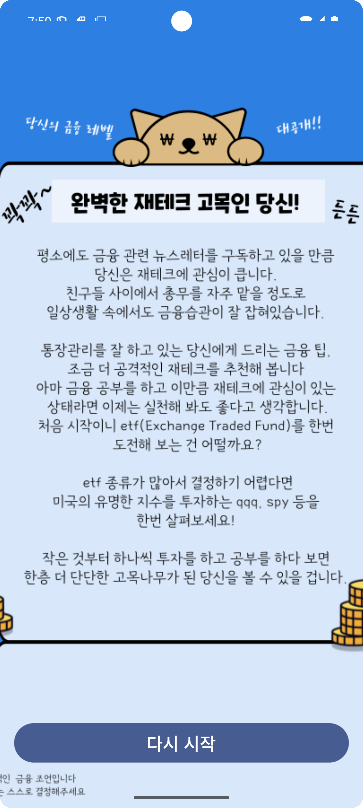
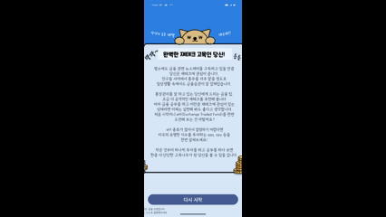

# 금융 테스트 앱

기존 Java/XML 성격 유형 테스트 앱에서 **금융 테스트** 기능을 분리해 Kotlin과 Jetpack Compose로 다시 구성한 Android 프로젝트입니다.

원본 저장소: [MK-SideProject/personality-style-test-release2](https://github.com/MK-SideProject/personality-style-test-release2)

이 프로젝트의 목표는 단순히 화면을 Compose로 옮기는 것이 아니라, 질문과 결과 데이터를 교체하면 같은 화면 흐름을 재사용할 수 있는 구조를 만들고, 테스트 자동화와 커버리지 리포트로 리팩토링을 안전하게 진행하는 것입니다.

## 핵심 요약

| 항목 | 현재 상태 |
| --- | --- |
| 앱 범위 | 금융 테스트 1종 |
| 질문/결과 데이터 | JSON asset 기반, 질문 6개 / 결과 3개 |
| UI | Kotlin + Jetpack Compose |
| 상태 관리 | ViewModel + 단일 UiState |
| 결과 계산 | `ScoreBasedResultCalculator`로 분리 |
| 테스트 | unit test 29개, Compose UI flow test 1개 |
| 커버리지 | focused LINE 98.18%, BRANCH 87.50% |
| 자동화 | GitHub Actions, Kover, coverage summary, PR 라벨 자동화 |

## 앱 흐름

| 1. 메인 | 2. 질문 | 3. 결과 |
| --- | --- | --- |
|  |  |  |
| `테스트 시작!` 버튼으로 금융 테스트를 시작합니다. | JSON 데이터의 질문/답변을 같은 `QuizScreen`으로 표시합니다. | 모든 답변을 선택하면 점수 기반 결과가 표시됩니다. |

### 기능 시연



결과 화면에서 다시 시작하면 상태가 초기화되고 첫 질문 흐름으로 돌아갑니다.

## 리팩토링 방향

| 구분 | 기존 Java/XML 방식 | 현재 Kotlin/Compose 방식 |
| --- | --- | --- |
| 화면 구성 | 테스트/화면별 Activity, Fragment, XML 분산 | 단일 Activity + 재사용 가능한 Composable |
| 질문 데이터 | 코드와 리소스에 강하게 결합 | `app/src/main/assets/quizzes/banking.json` |
| 결과 계산 | 문자열 flag, Bundle, if/else 흐름에 의존 | `ResultCalculator` 인터페이스와 구현체로 분리 |
| 상태 관리 | 화면 이동과 상태 변경이 섞이기 쉬움 | ViewModel의 단일 `QuizUiState` |
| 회귀 검증 | 수동 확인 중심 | unit test, Compose UI test, CI 자동화 |
| 품질 확인 | 별도 기준 없음 | Kover focused coverage와 HTML 품질 리포트 |

## 프로젝트 구조

```text
.
├── app/
│   └── src/
│       ├── main/
│       │   ├── assets/quizzes/banking.json
│       │   └── java/com/bankingtest_kotlin/
│       │       ├── data/
│       │       ├── domain/
│       │       ├── navigation/
│       │       ├── presentation/
│       │       └── ui/
│       ├── test/
│       └── androidTest/
├── docs/
├── scripts/
├── .github/workflows/
└── gradle/libs.versions.toml
```

## 테스트와 커버리지

이 프로젝트는 전체 앱 coverage를 억지로 높이는 대신, 리팩토링 중 회귀를 막는 데 의미가 큰 코드에 focused coverage를 적용합니다.

대표 측정 대상:

- 결과 계산 로직
- JSON 데이터 파싱/매핑
- ViewModel 상태 전이

현재 품질 리포트 기준:

| 지표 | 결과 |
| --- | ---: |
| focused LINE | 98.18% |
| focused BRANCH | 87.50% |
| focused INSTRUCTION | 98.17% |
| low coverage areas | 0 |
| unit tests | 29 passed |
| Compose UI flow test | 1 passed |

위 수치는 금융 테스트 데이터를 JSON으로 분리하고, 결과 계산 로직과 ViewModel 상태 전이를 테스트 가능하게 정리한 뒤 반영된 결과입니다.

<details>
<summary>AI 커버리지 품질 리포트 미리보기</summary>

<br>


</details>

로컬 실행:

```powershell
$env:JAVA_HOME='C:\Program Files\Android\Android Studio\jbr'
$env:Path="$env:JAVA_HOME\bin;$env:Path"
$env:ANDROID_HOME="$env:LOCALAPPDATA\Android\Sdk"
$env:ANDROID_SDK_ROOT=$env:ANDROID_HOME

.\gradlew.bat :app:testDebugUnitTest :app:assembleDebug
.\gradlew.bat :app:koverHtmlReportDebug :app:koverXmlReportDebug
python3 scripts/coverage_summary.py
```

리포트 산출물:

- `app/build/reports/kover/htmlDebug/index.html`
- `build/reports/coverage-summary/coverage-report.html`
- `build/reports/coverage-summary/coverage-summary.md`
- `build/reports/coverage-summary/coverage-pr-summary.md`

자세한 기준은 [커버리지 운영 기준](./docs/coverage.md)을 확인할 수 있습니다.

## AI 활용 자동화

AI는 코드 작성 보조뿐 아니라 반복적인 품질 관리 작업을 줄이는 방향으로 활용했습니다.

- 이슈 단위 작업 분해
- 테스트 후보 도출
- 커버리지 리포트 해석
- PR/이슈 기록용 요약 생성
- 다음 보완 후보 정리
- README와 기술 문서 초안 정리

관련 문서: [AI 활용 테스트 자동화 정리](./docs/ai-test-automation-report.md)

## CI 자동화

GitHub Actions에서 다음 작업을 자동으로 실행합니다.

- debug unit test
- debug build
- focused Kover HTML/XML report
- coverage summary Markdown/JSON/HTML 생성
- test/coverage artifact 업로드
- PR 라벨 자동 부착

`develop` 대상 PR에서는 빠른 focused coverage를 중심으로 확인하고, `main` push 또는 수동 실행에서는 전체 참고 coverage도 생성합니다.

## 참고 문서

- [빌드 및 테스트 기준선](./docs/build-test-baseline.md)
- [커버리지 운영 기준](./docs/coverage.md)
- [AI 활용 테스트 자동화 정리](./docs/ai-test-automation-report.md)
